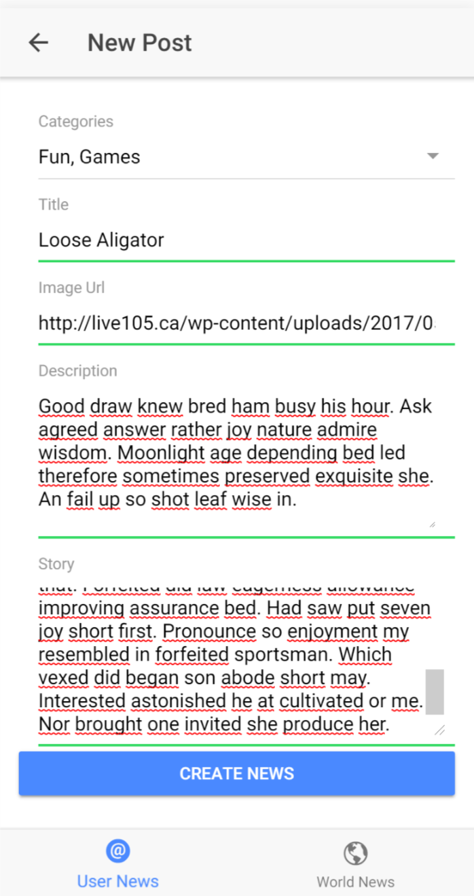

## How to use application HF

*This is a news application*. 

-npm install
-ionic serve

### Brief App overview:
### NOTE this is just a overview there is a lot more stuff!
The app (INEWS) is a news application made in Ionic and using firebase a Realtime database. Where the users can check real news sources and read another users news. And if logged in, even post their own news articles. 

  
  
  

When created a new post it gets posted on the node where all users can read and on the node where the user can handle and see their own posts. When a user deletes their post, it gets deleted in both nodes. The user gets authenticated with firebase and if user isn’t authenticated he can’t see the add post button or his profile, although he can see the posts. The authentication is setup in the firebase rules

  

